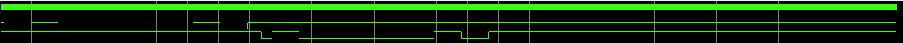

# UART Communication System Design (Verilog HDL)

## 1. Project Overview
* **Description:** Designed and verified a UART (Universal Asynchronous Receiver/Transmitter) module using Verilog HDL. The project includes a Baud Rate Generator, Transmitter (Tx), Receiver (Rx), and a Loopback system for verification.
* **Duration:** 2025.12 (Independent Project)
* **Tools:** Intel Quartus Prime Lite, ModelSim-Intel FPGA Edition
* **Language:** Verilog HDL

## 2. Key Features
### A. System Specifications
* **Clock Frequency:** 50MHz
* **Baud Rate:** 115200 bps
* **Data Format:** 8 Data bits, No Parity, 1 Stop bit (8N1)

### B. Module Details
1.  **Baud Rate Generator:**
    * Generates a `tick` signal for 115200 bps communication by dividing the 50MHz system clock.
2.  **Transmitter (Tx):**
    * Implements FSM (IDLE → START → DATA → STOP).
    * Serializes parallel data to single-bit output.
3.  **Receiver (Rx):**
    * Implements oversampling logic to capture data at the center of the bit period for stability.
    * Deserializes incoming serial data to parallel output.
4.  **Loopback System (Top Module):**
    * Connects Rx output directly to Tx input to verify full-duplex communication (Echo system).

## 3. Simulation & Verification (Results)
**Successfully verified data loopback functionality using ModelSim.**
* **Test Scenario:** Sent character 'A' (0x41) → FPGA Rx → Internal Buffer → FPGA Tx → Received 'A'.
* **Result:** The Tx output waveform matches the Rx input waveform with expected processing delay.

## 4. Problem Solving (Troubleshooting)
> **Challenge:** During the Rx module simulation, the `dout` (output) remained `0` even though the internal shift register correctly received the data (0x37).

* **Analysis:** Debugged using ModelSim by adding internal signals (`shift_reg`, `bit_cnt`) to the wave window. Confirmed that data shifting was correct, but the final assignment to the output port was missing.
* **Solution:** Added the logic `dout <= shift_reg;` in the **STOP state** of the FSM.
* **Outcome:** The output correctly updated to `0x37` upon the `rx_done` signal, confirming the fix.

## 5. Directory Structure
├── top_uart_loopback.v # Top Module (Entire System) ├── uart_rx.v # Receiver Module ├── uart_tx.v # Transmitter Module ├── baud_gen.v # Baud Rate Generator (If separate) ├── tb_uart_loopback.v # Testbench file └── uart_final_wave.png # Simulation Result Image
